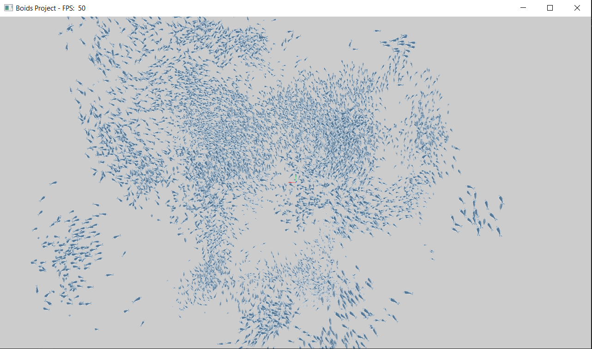

# OpenGLBoids
A little practice portfolio project for me to apply some of the graphics programming I learnt at university
As this is a learning project, it was completed without the use of AI in any way, shape, or form to maximise my own learning

The goal of this project is a 3D boids simulation which runs entirely on the GPU in the form of a compute shader. Take a look at [this](https://en.wikipedia.org/wiki/Boids) to learn what boids are. By using some somewhat advanced opengl techniques, notably gpu instancing with shader storage buffer objects storing the position and direction of the boids. By ping-ponging the buffers and only using the most recently written buffer within the vertex shader to instance the boids, we can avoid ever having to read the boid data back from VRAM to regular RAM. This approach has enabled me to get to up to 8192 boids simulated and rendering concurrently at above 30 frames per second!

libraries used:
- openGL
- glfw
- gl3w
- glm
- stb image loader
- Tiny object loader